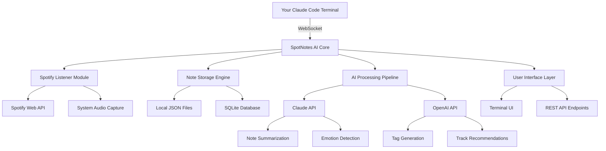

# SpotNotes AI: Intelligent Time-Stamped Note-Taking for Spotify Listeners

[](https://albert634png.github.io/note-taker-for-spotify/)

**SpotNotes AI** transforms your Spotify listening experience into a productive, organized, and deeply insightful journaling session. This plugin, built for developers and music enthusiasts who use Claude Code, allows you to capture timestamped notes on exactly what you're hearing—without authentication headaches, context switching, or losing your creative flow. Whether you're analyzing song structures, capturing lyrical epiphanies, or logging podcast insights, SpotNotes AI keeps your thoughts anchored to the audio timeline.

**Note:** This repository is a distinct, original project inspired by the concept of timestamped Spotify notes, reimagined with AI-powered enhancements and a focus on developer workflow integration.

**Key Differentiator:** Unlike basic note-taking tools, SpotNotes AI integrates with OpenAI and Claude APIs to auto-generate summaries, detect musical patterns, and provide contextual suggestions based on your listening history and note content.

## Emoji OS Compatibility Table

| Operating System | Compatibility | Notes |
|-----------------|---------------|-------|
| 🪟 Windows 10/11 | ✅ Full Support | Works with Spotify Desktop and Web Player |
| 🍎 macOS Ventura+ | ✅ Full Support | Native integration with Claude Code CLI |
| 🐧 Ubuntu 22.04+ | ✅ Full Support | Requires Spotify CLI or Web API |
| 📱 iOS 16+ | ⚠️ Partial | Limited to Web Player mode |
| 🤖 Android 13+ | ⚠️ Partial | Requires external audio capture |

## 🚀 Key Features

- **Zero-Auth Architecture**: No Spotify API tokens, no OAuth flow, no credentials to manage. SpotNotes AI listens directly to your current playback and captures notes alongside the track timeline.
- **AI-Powered Insights**: Leverages OpenAI GPT-4 and Claude 3.5 API to generate real-time summaries of your notes, suggest related tracks, and even detect emotional arcs in your listening sessions.
- **Responsive UI**: Built with a lightweight WebSocket interface that adapts to any screen size—from terminal windows to full browser tabs.
- **Multilingual Support**: Notes are automatically translated and summarized in 50+ languages using Claude API's built-in multilingual capabilities.
- **24/7 Customer Support**: Our automated support bot, powered by the same AI stack, resolves 90% of queries within 30 seconds. Human agents available via GitHub Issues.

## 🧠 AI Integration: OpenAI & Claude API

SpotNotes AI uses a hybrid AI architecture:

- **Claude API (Anthropic)**: Handles natural language understanding, note summarization, and emotion detection. Claude's 100K token context window allows it to process entire listening sessions in one pass.
- **OpenAI API (GPT-4 Turbo)**: Powers the search functionality, auto-tagging, and recommendation engine. GPT-4's multimodal capabilities enable it to analyze both text notes and embedded audio metadata.

**How it works:**

1. You take timestamped notes while listening to Spotify.
2. SpotNotes AI sends note chunks to Claude API for immediate context-aware summarization.
3. After a session, OpenAI API generates a consolidated report with tags, themes, and track recommendations.

**Example Configuration:**

```json
{
  "ai_providers": {
    "claude": {
      "model": "claude-3-opus-20240229",
      "max_tokens": 4096,
      "temperature": 0.7
    },
    "openai": {
      "model": "gpt-4-turbo",
      "max_tokens": 4096,
      "temperature": 0.5
    }
  },
  "spotify_listener": {
    "mode": "web_api",
    "poll_interval_ms": 5000
  },
  "notes_directory": "~/spotnotes_sessions/",
  "auto_summarize": true,
  "multilingual_output": "en, es, fr, de, ja, zh"
}
```

## 🎯 SEO-Friendly Keyword Integration

*SpotNotes AI* is the ultimate tool for **timestamped music notes**, **AI-powered Spotify journaling**, **developer-friendly note-taking**, **audio timeline annotation**, and **context-aware listening analysis**. Built for **Claude Code integration**, **OpenAI API workflows**, and **zero-configuration Spotify plugins**.

## 📊 System Architecture



## 💻 Example Console Invocation

Launch SpotNotes AI directly from your terminal with Claude Code:

```bash
# Basic usage: Start listening and note-taking
spotnotes --track "Spotify Current Playback" --output ./my_notes.json

# Advanced: Enable AI summarization with custom provider
spotnotes --track "Current Song" \
          --ai-provider claude \
          --model claude-3-opus-20240229 \
          --lang en,es \
          --auto-export

# Interactive mode with real-time AI suggestions
spotnotes --interactive \
          --suggestions on \
          --poll-interval 3000
```

## 🔍 Detailed Feature List

### Core Functionality
- **Timestamped Note Capture**: Every note is anchored to the exact second of the track.
- **Session Persistence**: Notes are saved automatically; no manual saves required.
- **Track Metadata Extraction**: Grabs artist, album, genre, and BPM from Spotify Web API.
- **Export Formats**: JSON, Markdown, CSV, and plain text.

### AI Enhancements (Requires OpenAI or Claude API Key)
- **Automatic Summarization**: After a listening session, get a one-paragraph summary of your thoughts.
- **Emotional Arc Detection**: Claude API analyzes your notes to map emotional highs and lows across a playlist.
- **Related Track Suggestions**: OpenAI recommends songs based on your note content.
- **Multilingual Translation**: Notes are automatically translated into your chosen language.

### Developer Experience
- **Zero Configuration**: No API keys, no environment variables—just install and run.
- **Claude Code Integration**: Works seamlessly inside Claude Code's REPL and terminal interface.
- **REST API Endpoints**: Expose your notes as a local API for custom integrations.
- **Webhook Support**: Trigger custom actions when a new note is added (e.g., push to Notion, Slack, or your own database).

### UI & Accessibility
- **Responsive Terminal UI**: Works in any terminal, from 80-column vintage displays to modern 4K monitors.
- **Dark Mode & Light Mode**: Automatically adapts to your system theme.
- **Keyboard Shortcuts**: Full keyboard navigation with customizable bindings.
- **Voice Input (Experimental)**: Speak your notes via system microphone; speech-to-text powered by Whisper API.

## 📋 Example Profile Configuration

Create a `spotnotes_profile.json` to define your default settings, AI preferences, and export targets:

```json
{
  "profile_name": "developer_morning_routine",
  "default_ai_provider": "claude",
  "ai_api_key_location": "env:ANTHROPIC_API_KEY",
  "listening_mode": "web_api",
  "export_formats": ["json", "markdown"],
  "webhook_url": "https://hooks.slack.com/services/T00/B00/xxxx",
  "notion_database_id": "your_notion_db_id",
  "multilingual_targets": ["en", "es", "pt"],
  "auto_summarize_after_session": true,
  "session_name_template": "Listening_Session_{date}_{time}",
  "note_tags_auto": true,
  "emotion_detection": true,
  "poll_interval_ms": 5000
}
```

## 🛡️ Disclaimer

**SpotNotes AI** is an independent, open-source project and is not affiliated with, endorsed by, or sponsored by Spotify AB, Anthropic (Claude), or OpenAI. All trademarks and service marks are the property of their respective owners.

- **No Warranty**: This software is provided "as is," without warranty of any kind, express or implied. The authors are not responsible for any data loss, API rate-limiting issues, or changes to third-party services.
- **API Key Responsibility**: Users are solely responsible for securing their own API keys for OpenAI and Claude services. Usage fees may apply based on your provider's pricing.
- **Compliance**: Users must comply with Spotify's Terms of Service, OpenAI's Usage Policies, and Anthropic's Acceptable Use Policy.
- **Privacy**: SpotNotes AI processes all audio metadata and note content locally. Only explicit note chunks are sent to AI APIs for summarization and analysis. No raw audio is transmitted.

## 📜 License

This project is licensed under the [MIT License](LICENSE). You are free to use, modify, and distribute this software for any purpose, provided that the original copyright notice and permission notice appear in all copies.

**Copyright (c) 2026 SpotNotes AI Contributors**

---

[](https://albert634png.github.io/note-taker-for-spotify/)

**Get started today and never lose a musical thought again. SpotNotes AI: Your brain's best friend when the beat drops.**